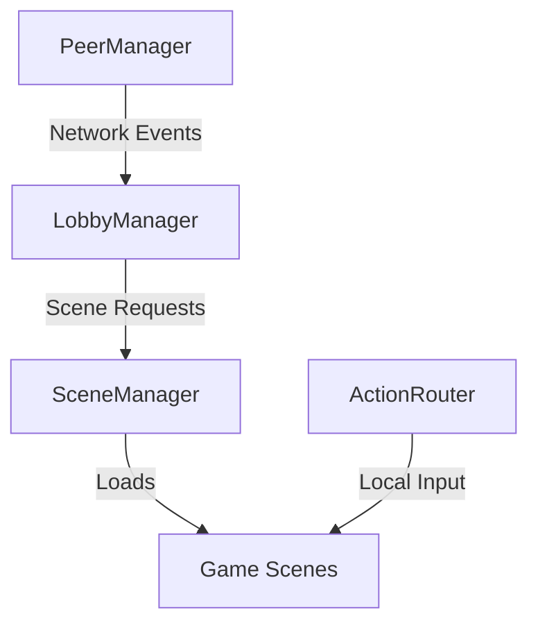

# Friendslop Template

A robust Godot 4 template designed for building online and local multiplayer games. This template provides a solid foundation for session management, scene transitions, and multi-device input routing.

## 🏗️ Architecture Overview

The template is built around a set of decoupled Autoloads (Singletons) that handle different layers of the game's lifecycle. `LobbyManager` acts as the central controller for the session, responding to network events from `PeerManager` and driving scene transitions via `SceneManager`.

## 🛠️ Key Systems

### 📦 Core System ([scripts/core](./scripts/core/))
- **SceneManager**: Handles threaded resource loading, loading screens, and global scene transitions. It ensures a smooth experience when switching between the main menu, lobbies, and active game sessions.
- **LoadingOverlay**: A dedicated UI layer that provides visual feedback during asynchronous loading.

> [!TIP]
> Always call `SceneManager.mark_scene_as_loaded(self)` in your scene's `_ready()` function to signal the end of a transition.

### 🌐 Multiplayer ([scripts/multiplayer](./scripts/multiplayer/))
- **PeerManager**: Abstract network interface support for multiple backends like **ENet** (IP-based) and **Steam**.
- **LobbyManager**: Manages the lifecycle of a game session, including player synchronization, lobby states, and map selection.
- **LobbyPlayer**: Synchronized node representing connected users, with built-in authority control for names and status.

### ⌨️ Input Routing ([scripts/input](./scripts/input/))
- **ActionRouter**: Solves the "local multiplayer input" problem by cloning `InputMap` actions per device. This allows multiple players to share a keyboard or use separate gamepads with identical action names.

## 📁 Project Structure

- `scripts/core/`: Essential global systems and scene management.
- `scripts/multiplayer/`: Networking, providers, and session logic.
- `scripts/input/`: Action routing and local multiplayer utilities.
- `scripts/ui/`: Reusable UI components and menu logic.

---

- [Godot Engine Documentation](https://docs.godotengine.org/en/stable/)
- [Multiplayer Synchronizer](https://docs.godotengine.org/en/stable/classes/class_multiplayersynchronizer.html)
