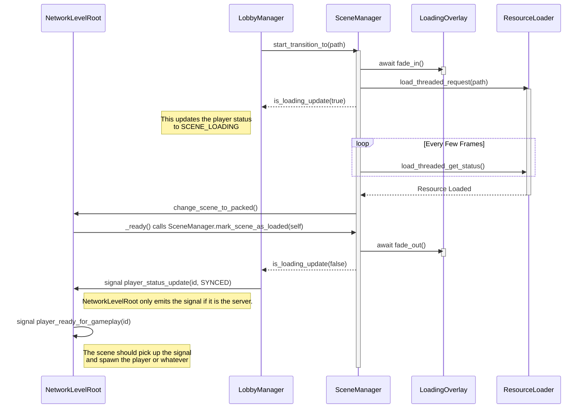

# Core Systems

This folder holds the scene management lifecycle for the template. These scripts handle the loading overlay and report whether the client is loading or not.

## SceneManager ([`scene_manager.gd`](./scene_manager.gd))

This autoload is responsible for transitioning between scenes via background loading while showing a loading screen and updating the loading screen's progress.

- The [`LobbyManager`](../multiplayer/lobby/README.md) will request a scene change when the `active_scene_path` property is updated.
- It creates a LoadingOverlay so users know something is happening.
- It unloads the old world and loads the new one.
- It waits for the new scene to be fully ready before removing the loading screen.

**Flow Diagram**

**How to use:** Call `SceneManager.start_transition_to("res://path/to/scene.tscn")` instead of the standard Godot change scene function.

## NetworkLevelRoot ([`network_level_root.gd`](./network_level_root.gd))

This node is responsible for informing the scene manager that the scene is loaded, and announcing players ready for gameplay.

To be used with the [PlayerSpawnManager](../multiplayer/player_spawning/README.md) to handle the lifecycle of clients.