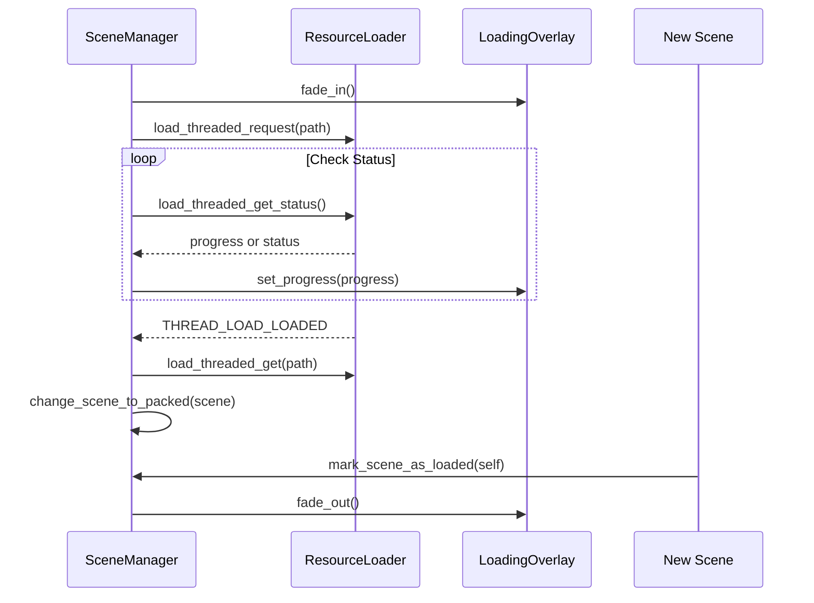

# Core Components

This directory contains essential low-level systems that manage the game's global state and transitions.

## SceneManager

`SceneManager` (Autoload) is responsible for handling high-level scene transitions, loading screens, and threaded resource loading.

### Lifecycle
1. **Initialization (`_init/_ready`)**:
   - Creates the `LoadingOverlay` canvas layer.
   - Initializes the internal timer for load status checks.

2. **Transition Flow**:
   - `start_transition_to(path)` is called.
   - The `LoadingOverlay` fades in.
   - `ResourceLoader.load_threaded_request` begins loading the target scene.
   - A timer checks the load status every frame/tick.
   - Once loaded (`THREAD_LOAD_LOADED`), `change_scene_to_packed` is called.
   - The new scene instantiates and calls `SceneManager.mark_scene_as_loaded(self)` in its `_ready` function.
   - The `LoadingOverlay` fades out.



### Usage
- **Transitioning manually**:
  ```gdscript
  SceneManager.start_transition_to("res://scenes/MyLevel.tscn")
  ```
- **Returning to Main Menu**:
  ```gdscript
  LobbyManager.disconnection_reason = "Reason for Disconnect"
  SceneManager.go_to_main_menu()
  ```
- **Marking a scene as loaded** (Required in every main scene script):
  ```gdscript
  func _ready():
	  SceneManager.mark_scene_as_loaded(self)
  ```
