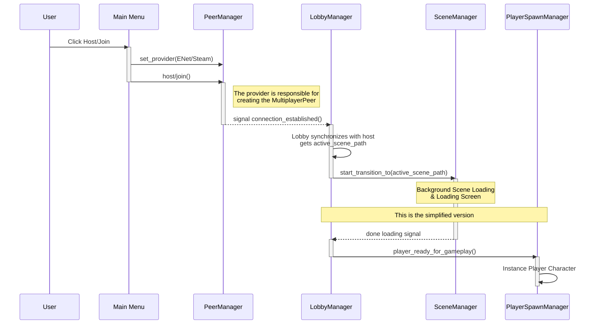

# Multiplayer Systems 📡

This is the heavy lifter of the template. It handles everything involved in getting players connected and playing together.

## 📂 Subsystems

- **[`lobby/`](./lobby/README.md)**: Handles connected players and their meta data (Status, Name, peer_id, etc.)
- **[`network/`](./network/README.md)**: The low-level `PeerManager` & Network Provider implementations.
- **[`player_spawning/`](./player_spawning/README.md)**: Logic for how to spawn players in the world.
- **[`replication/`](./replication/README.md)**: Nodes for synchronizing world state, especially for late-joining players.

## 🏗️ Connection Architecture

## 🤝 Peer Manager

The **`PeerManager`** is your single source of truth for the connection state. Whether you are the Host or a Client, this script manages the `MultiplayerPeer`.

- **ENet**: Standard Godot networking. Good for testing and direct IP connections.
- **Steam**: Not yet integrated, but could be added as a network provider with minimal changes to the rest of the application.

## 🛠️ Core Components

- **[`LobbyManager`](../lobby/README.md)**: Orchestrates the game session, tracking player readiness and broadcasting the active scene.
- **[`Handshake System`](../multiplayer/replication/README.md)**: Uses `HandshakeSpawner` and `HandshakeSynchronizer` to ensure late-joining clients are perfectly synced to your gameplay scenes before they start playing.