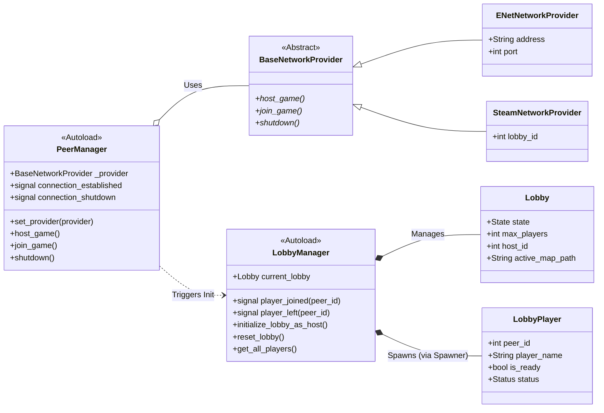
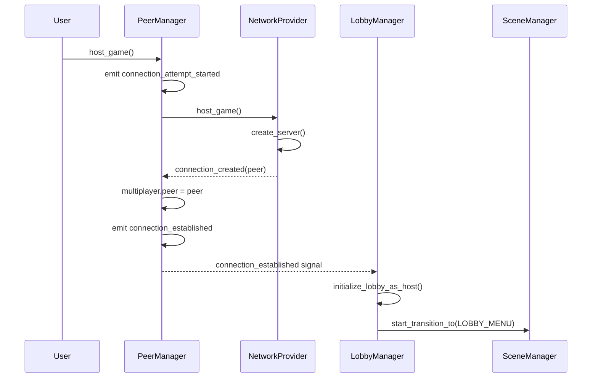
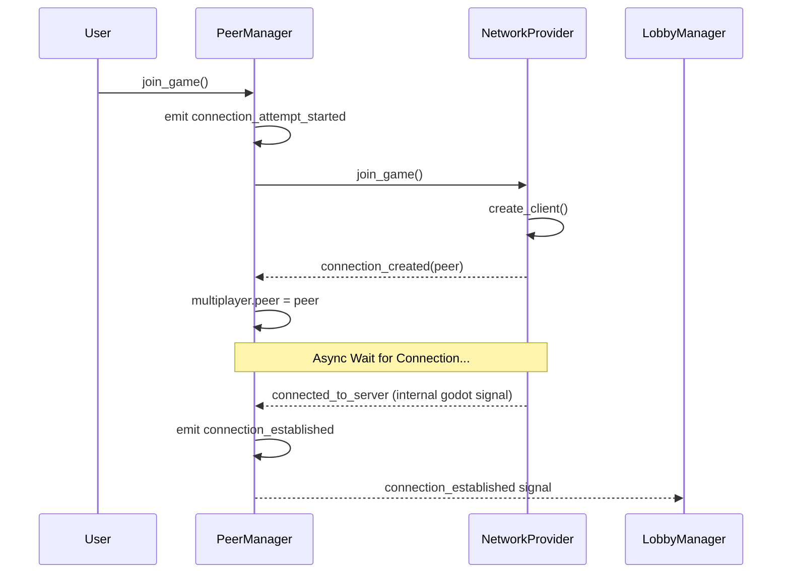

# Multiplayer Components

This directory manages networking, lobby state, and player synchronization.

## System Overview



## PeerManager

`PeerManager` (Autoload) abstracts the network interface, handling the creation and destruction of the `MultiplayerPeer`. It delegates actual connection logic to a `BaseNetworkProvider`.

The connection process is **asynchronous**. You should listen to the `connection_established` and `connection_shutdown` signals.

### Signals
- `connection_attempt_started`: Emitted when `host_game()` or `join_game()` is called.
- `connection_established`: Emitted when the peer is ready (server started or client connected).
- `connection_shutdown(reason)`: Emitted when the peer is closed or disconnects.

### Usage
```gdscript
# ENet
PeerManager.set_provider(ENetNetworkProvider.new("127.0.0.1", 7000))
PeerManager.host_game()

# Steam (Skeleton)
PeerManager.set_provider(SteamNetworkProvider.new(steam_lobby_id))
PeerManager.join_game()
```

### Host Game Flow



### Join Game Flow



---

## LobbyManager

`LobbyManager` (Autoload) governs the session logic above the transport layer. It manages the `Lobby` state and the player collection.

### Key Features
- **Player Spawning**: Uses a `MultiplayerSpawner` to replicate `LobbyPlayer` nodes across all clients automatically.
- **Node Management**: Maintains a `LobbyPlayers` container for organized player node management.
- **Unified Signals**: Emits `player_joined` and `player_left` based on internal node lifecycle events.

---

## Data Structures

### Lobby
A synchronized node representing the overall session state.
- **Synchronized Properties**: `active_map_path`, `state`, `max_players`, `host_id`.
- **States**: `NOT_CONNECTED`, `SERVER_LOADING`, `LOBBY`, `IN_GAME`, `POST_GAME`.

### LobbyPlayer
Represents a connected user. It uses TWO `MultiplayerSynchronizer` nodes for granular authority control:
- **PlayerSynchronizer**: Owned by the player. Syncs `player_name` and `is_ready`.
- **ServerSynchronizer**: Owned by the server. Syncs `status`.

---

## Network Providers

All providers inherit from `BaseNetworkProvider` and implement:
- `host_game()`: Initializes the server peer.
- `join_game()`: Initializes the client peer.
- `shutdown()`: Cleans up the peer and resources.

| Provider | Tech | Connectivity |
| :--- | :--- | :--- |
| `ENetNetworkProvider` | UDP/ENet | IP & Port |
| `SteamNetworkProvider` | Steam Networking | Steam Lobby ID |
