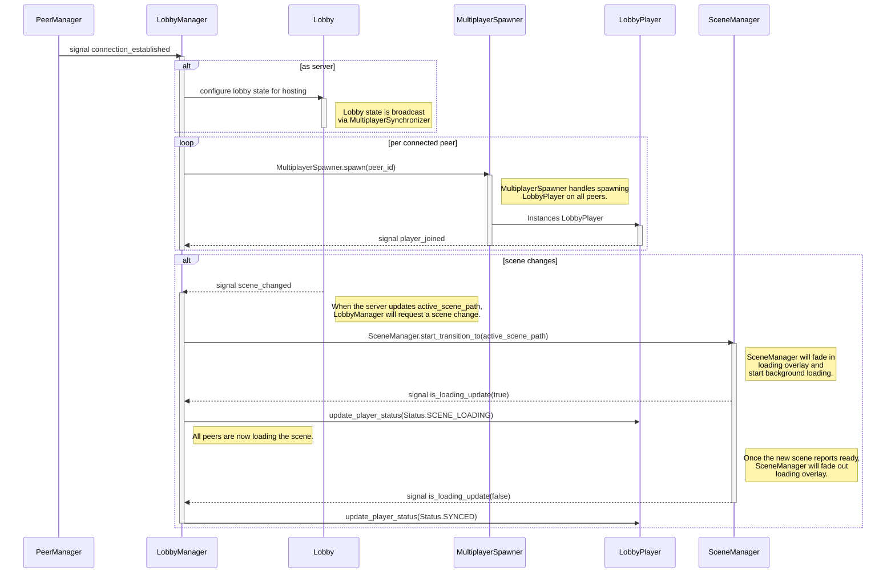

# Lobby System 👥

This folder contains the nodes for tracking connected players and their name/status in a multiplayer session. The lobby is also responsible for announcing the current scene to all players.

## 📂 Components

-   [`LobbyManager`](./lobby_manager.gd): This autoload orchestrates the lobby & lobby player lifecycles, handling player joins/leaves, status updates, and it leverages [SceneManager](../../core/README.md) for scene transitions.
    - The [Lobby](./lobby.gd) node is a data container that represents the current lobby status and the active map.
    - [LobbyPlayer](./lobby_player.gd) nodes are data containers that represent a connected peer and their name/status (`CONNECTING`, `SCENE_LOADING`, `SYNCED`, `IN_GAME`).
    - Both are synchronized via [MultiplayerSynchronizer](https://docs.godotengine.org/en/stable/classes/class_multiplayersynchronizer.html). MultiplayerSync/Spawn nodes work best in autoloads.

## 🏗️ Architecture Overview

