# Player Spawning 📍

The **Player Spawning System** manages the lifecycle of player characters within a game level. It bridges the gap between lobby management and in-game representation by controlling the [Replication System](../replication/README.md) based on the each client's scene readiness (see [Scene Manager](../../core/README.md)).

## 🏗️ Architecture

The system uses a **Strategy Pattern** to determine how and where players appear. 

- **The Manager (`BasePlayerSpawnManager`)**: An abstract base class that listens for gameplay readiness from [NetworkLevelRoot](../../core/README.md) and orchestrates the spawn/despawn process on the [HandshakeSpawner](../replication/README.md).
- **The Spawner ([`HandshakeSpawner`](../replication/README.md))**: Performs the actual replication of the player node through an abstract `SpawnableResource` interface.
- **Strategies**: Specific implementations that define the "where":
    - `SimplePlayerSpawnManager`: Passes only the `peer_id`. Useful when the player scene handles its own placement.
    - `RandomPlayerSpawnManager`: Picks a random child from a designated `spawn_points` node.

## 🔄 Spawning Flow

```mermaid
sequenceDiagram
    participant Peer as Client Peer
    participant Lobby as LobbyManager
    participant Level as NetworkLevelRoot
    participant Manager as PlayerSpawnManager
    participant Spawner as HandshakeSpawner
    participant All as All Clients

    rect rgb(30, 30, 40)
    Note over Peer, All: Phase 1: Connection & Readiness
    Peer->>Lobby: Connects to server
    activate Lobby
    Lobby->>Lobby: Server spawns LobbyPlayer
    deactivate Lobby
    
    Note over Peer: Client loads level scene
    
    Peer->>Lobby: Update status to SYNCED
    activate Lobby
    Lobby-->>Level: player_status_update
    deactivate Lobby
    
    activate Level
    Level->>Manager: player_ready_for_gameplay(peer_id)
    deactivate Level
    end

    rect rgb(30, 40, 30)
    Note over Manager, Spawner: Phase 2: Spawning
    activate Manager
    Manager->>Manager: _get_spawn_params(peer_id)
    Manager->>Spawner: spawn(label, params)
    activate Spawner
    Spawner-->>All: Sync instantiation
    Spawner->>Manager: spawned(node, request)
    deactivate Spawner
    Manager->>Manager: Track peer_id -> spawn_id
    deactivate Manager
    end

    rect rgb(40, 30, 30)
    Note over Peer, All: Phase 3: Disconnection
    Peer->>Lobby: Disconnects
    activate Lobby
    Lobby->>Lobby: Server removes LobbyPlayer
    Lobby->>Manager: player_left(peer_id)
    deactivate Lobby
    
    activate Manager
    Manager->>Spawner: despawn_id(spawn_id)
    activate Spawner
    Spawner-->>All: Sync removal
    Spawner->>Manager: despawned(spawn_id)
    deactivate Spawner
    Manager->>Manager: Untrack peer_id
    deactivate Manager
    end
```

## 🛠️ Components

### `BasePlayerSpawnManager` (Abstract)
The "Brain" of the operation. It connects to [`NetworkLevelRoot`](../../core/README.md) and [`LobbyManager`](../lobby/README.md) to handle player entry and exit.
- **Signal**: `player_ready_for_gameplay` triggers the spawn.
- **Cleanup**: Automatically despawns the player's network object when they leave the lobby.

### `RandomPlayerSpawnManager`
Best for deathmatches or shared maps.
- **Setup**: Create a Node (e.g., "SpawnPoints") and add `Marker2D` or `Node3D` children at your desired locations.
- **Export**: Assign that parent Node to the `spawn_points` property.

### `SimplePlayerSpawnManager`
Minimalist approach.
- **Logic**: Only provides the `peer_id` to the spawner.
- **Use Case**: When players spawn at a fixed location or if the player scene contains its own entry logic.

## 🔌 Integration

1.  Add a **Spawn Manager** (e.g., `RandomPlayerSpawnManager`) to your level scene.
2.  Assign the [`NetworkLevelRoot`](../../core/README.md) and [`HandshakeSpawner`](../replication/README.md) references.
3.  Ensure the `player_spawner_label` matches a configured resource in your [`HandshakeSpawner`](../replication/README.md).
4.  If using `RandomPlayerSpawnManager`, assign your container of spawn markers to `spawn_points`.

## 🆕 Custom Strategies

To create a new spawning rule (e.g., Team-based spawning, Distance-based spawning):
1.  Extend `BasePlayerSpawnManager`.
2.  Override `func _get_spawn_params(peer_id: int) -> Dictionary`.
3.  Return a dictionary containing at least `"peer_id": peer_id`.