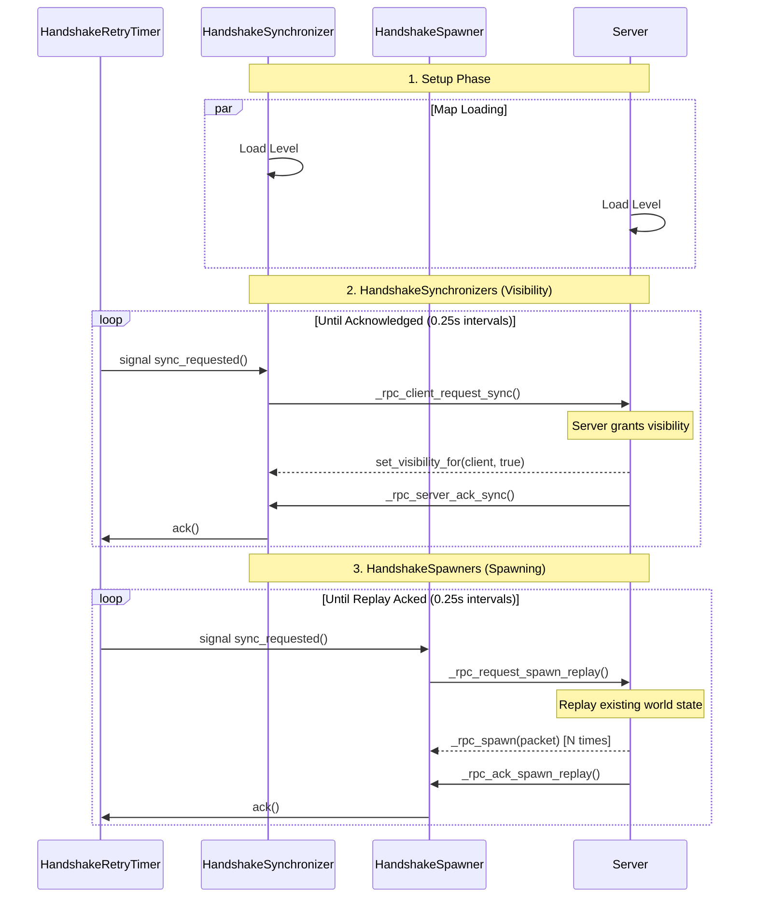

# Replication (The Handshake) 🤝

Multiplayer games often suffer from "race conditions"—like the server announcing "spawn" before the client has the scene loaded.

Godot's default `MultiplayerSpawner` is great, but it wasn't working with our use `get_tree().change_scene_to*()` so we created our own **Handshake Replication System** to guarantee reliability.

## 🕹️ How it Works

1.  **Connect**: Client connects to the Host.
2.  **Load**: Both parties load the map scene.
3.  **Ready Up**: Individual `HandshakeSynchronizer` nodes and `HandshakeSpawner` nodes tell the server: "Please let me in!"
4.  **Sync/Spawn**: Only after receiving this request does the Server replay events from the `HandshakeSpawner` and enable syncing from `HandshakeSynchronizer` nodes. 

## 📑 Handshake Sequence

## 🛠️ Key Components

-   **`HandshakeSpawner`**: Replaces the standard `MultiplayerSpawner`. It is built entirely through GDScript and RPCs, and it manages the instantiation of any node that is registered in the `spawnables` dictionary.
    - You map a label to a resource path in the `spawnables` dictionary.
    - When you call `spawn(type, params)`, it will use the `type` => `SpawnableResource` to `resource.spawn(params)` spawn the node.
    - When you call `despawn_id(s_id)`, it will use the `type` => `SpawnableResource` to `resource.teardown(node)` despawn the node.
-   **`HandshakeSynchronizer`**: An extension of the [MultiplayerSynchronizer](https://docs.godotengine.org/en/stable/tutorials/multiplayer/multiplayer_synchronizer.html) that only enables syncing when the client has requested it.
-   **`HandshakeRetryTimer`**: A helper that ensures requests are sent repeatedly until the server acknowledges them, overcoming potential packet loss or an un-ready scene tree.
-   **`SpawnRequest`**: A data object representing a pending spawn operation, including its type and specific parameters.

This system ensures that all clients can sync with retry behavior.